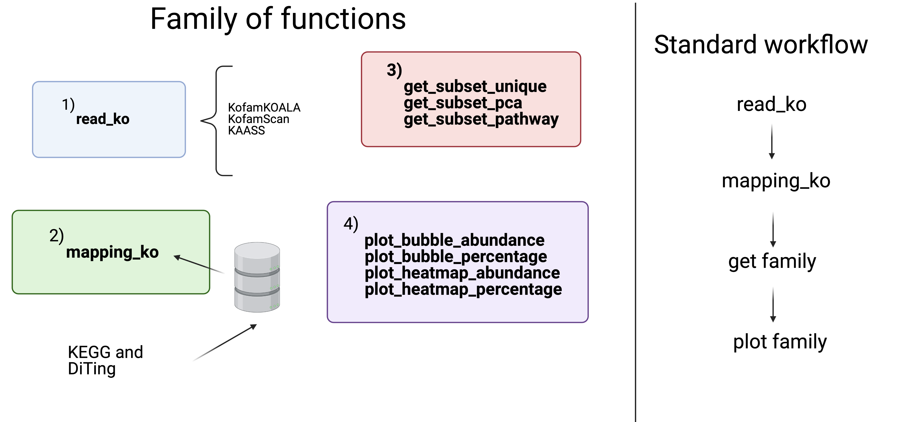

<!-- README.md is generated from README.Rmd. Please edit that file -->

<!-- badges: start -->
[](https://github.com/mirnavazquez/RbiMs/actions)
<!-- badges: end -->

# **Rbims** 

<!-- badges: start -->
<!-- badges: end -->

R tools for reconstructing bin metabolisms.

## Quick install

In R terminal:

``` r
if (!requireNamespace("BiocManager", quietly = TRUE)) install.packages("BiocManager")
BiocManager::install(c("KEGGREST", "devtools"))
```

And the development version from
[GitHub](https://github.com/mirnavazquez/RbiMs) with:

``` r
library(devtools)
install_github("mirnavazquez/RbiMs")
library(rbims)
```

## Overview



##  Quick Example

Read the kofamScan output and the metadata file. The metadata file is a tab-separated file containing the name of your bins and any extra information you would like to use for visualization.

```r 
ko_bin_table<-read_ko(data_kofam = "all.kofam.txt")
metadata <-read.table("metadata.txt", sep = "\t")
```

Then map the KO to the rest of the features of the KEGG database and rbims database.

```r 
ko_bin_mapp<-mapping_ko(ko_bin_table)
```

Let's say that you are interested in the genes associated with the biofilm formation in Vibrio Cholerae.

- One first thing could be to create a vector containing the name of the KEGG pathway associated with the biofilm formation in Vibrio Cholerae.

```r 
Biofilm_Vibrio<-c("map05111")
```

- Now, let's extract the profile associated with that metabolic pathway.

```r 
Biofilm_Vibrio_subset<-ko_bin_mapp%>%
  drop_na(Pathway) %>%
  get_subset_pathway(Pathway, Biofilm_Vibrio) 
```
- Now, let's create a plot. 

```r 
plot_bubble_percentage(tibble_ko = Biofilm_Vibrio_subset, 
                       data_experiment = metadata,
                       x_axis = Bin_name, 
                       y_axis = Genes,
                       color_character=Genus,
                       range_size = c(5,6))
```

##  Order axis

Let's say that you want to order by bin names.

- Create a vector containing the order.

```r 
order_taxa<-c("Bin_1", "Bin_2", "Bin_10", "Bin_113")
```

- Now plot, using the order_bins argument

```r 
plot_bubble_percentage(tibble_ko = Biofilm_Vibrio_subset, 
                       data_experiment = metadata,
                       x_axis = Bin_name, 
                       y_axis = Genes,
                       order_bins=order_taxa,
                       color_character=Genus,
                       range_size = c(5,6))
```

##  References

-   Kanehisa, M. and Goto, S.; KEGG: Kyoto Encyclopedia of Genes and
    Genomes. Nucleic Acids Res. 28, 27-30 (2000).
-   Kanehisa, M; Toward understanding the origin and evolution of
    cellular organisms. Protein Sci. 28, 1947-1951 (2019).
-   Kanehisa, M., Furumichi, M., Sato, Y., Ishiguro-Watanabe, M., and
    Tanabe, M.; KEGG: integrating viruses and cellular organisms.
    Nucleic Acids Res. 49, D545-D551 (2021).
-   [DiTing](https://github.com/xuechunxu/DiTing) cycles definition.
